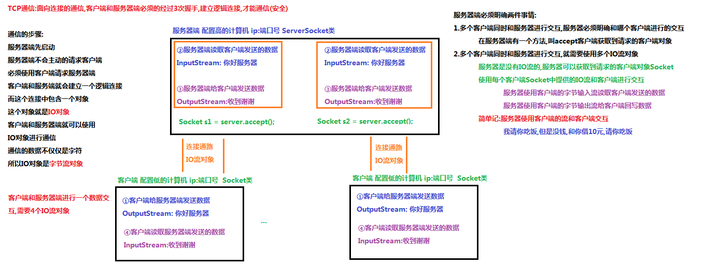

# javase_repository
这是我写javase练习的仓库 
## java基础的思维导图
[javase思维导图](https://www.processon.com/view/5f1636ace0b34d54dabdd17f#map)
## java多线程
[你还敢说不懂Java多线程](https://blog.csdn.net/weixin_42870497/article/details/118155614)
## java反射
[反射还可以这样学？](https://blog.csdn.net/weixin_42870497/article/details/118338948)
## TCP通信

